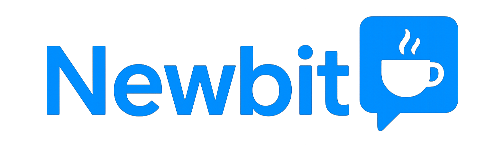

# NewBit - 개발자 멘토링 플랫폼

<div align="center">
  
</div>

## 📝 프로젝트 소개

Newbit은 사회 초년생과 지식과 다양한 경험을 가진 IT 전문가들이 자유롭게 소통하고 함께 성장할 수 있도록 돕는 지식 멘토링 커뮤니티 플랫폼입니다. 멘토는 자신의 인사이트를 칼럼과 커피챗(1:1 상담) 형식으로 공유하고, 멘티(일반 사용자)가 이를 구매하거나 구독하여 성장에 필요한 정보를 얻을 수 있습니다.

> 실무에 막 발을 디딘 신입 개발자에게는 실제 경험이 담긴 조언이 가장 필요합니다.  
> 하지만 그런 정보는 검색으로 쉽게 찾을 수 없습니다.  
> **Newbit**은 실무 경험이 담긴 콘텐츠를 연결하고, 더 나아가 사람을 연결합니다.

### 🎯 이런 문제들을 해결하고자 합니다
🙋‍♀️ 멘티에게는

- 칼럼/시리즈와 1:1 커피챗을 통해 믿을 수 있는 멘토의 실무 지식을 제공받을 수 있습니다.

- 입사 초기에 어려움을 겪는 문서 작성, 양식 문제를 쉽게 해결할 수 있도록 도와줍니다.

- 다양한 IT 관련 주제를 자유롭게 이야기할 수 있는 커뮤니티를 제공합니다.

👨‍🏫 멘토에게는

- 본인의 커리어 경험을 정리해 콘텐츠로 만들고 수익화할 수 있는 기회를 제공합니다.
  
- 커피챗을 통해 멘티와 깊이 있는 교류를 나눌 수 있습니다.

**이 레포지토리는 한화 BEYOND 부트캠프 15기 'LetsGetIt' 팀의 학습과 협업을 위한 프로젝트 파일을 담고 있습니다.<br>
모든 문서와 코드에 서술된 내용은 학습 목적으로 설정된 가상의 데이터와 환경을 기반으로 작성되었습니다.**


## 👨‍👩‍👧‍👦 팀원

| 이름   | 역할        | GitHub                                        |
| ------ | ----------- | :---------------------------------------------: |
| 김경민 | 백엔드 개발 | [gyeongmin03](https://github.com/gyeongmin03) |
| 김기홍 | 백엔드 개발 | [Kihong12](https://github.com/Kihong12)       |
| 김진영 | 백엔드 개발 | [kimjy8937](https://github.com/kimjy8937)     |
| 김채원 | 백엔드 개발 | [sezeme](https://github.com/sezeme)   |
| 박양하 | 백엔드 개발 | [64etuor](https://github.com/64etuor)         |
| 오유경 | 백엔드 개발 | [oyk0510](https://github.com/oyk0510)         |

## 🛠 기술 스택

<div align="center">
  
### Backend & Database
  


### Frontend


### Communication Protocols


### Tools & Communication


</div>

## 🔗 문서 링크

### 프레젠테이션

- [Powerpoint 문서](https://docs.google.com/presentation/d/11G4_GNc5dlZcgKw5RPP-vGZSRRCIeN7t/edit#slide=id.p1)

### API 문서

- [Swagger API 문서](https://64etuor.github.io/700_studies/2501-2507-한화beyond-sw캠프/1_프로젝트/2차-백엔드/api-docs/dist/)

### 설계 문서

- [DDD 설계 문서](https://miro.com/app/board/uXjVINvVwgo=/?share_link_id=532750127721)
- [요구사항 명세서](https://docs.google.com/spreadsheets/d/1aflf9F-G79LgBtK9sxy4J_ZFPHslv-X5P6s3-67kGR4/edit?gid=721187272#gid=721187272)
- [기능 명세서](https://docs.google.com/spreadsheets/d/1aflf9F-G79LgBtK9sxy4J_ZFPHslv-X5P6s3-67kGR4/edit?gid=55030434#gid=55030434)
  
### 테스크 결과 보고서

- [테스트 결과 보고서](https://docs.google.com/document/d/1eEU6sED_ITLF-2X6D3e6yWcYB-gYg7WDk_agsvssvpw/edit?tab=t.0)
- [Test Coverage Report](https://64etuor.github.io/700_studies/2501-2507-%ED%95%9C%ED%99%94beyond-sw%EC%BA%A0%ED%94%84/1_%ED%94%84%EB%A1%9C%EC%A0%9D%ED%8A%B8/2%EC%B0%A8-%EB%B0%B1%EC%97%94%EB%93%9C/test_report/jacocoHtml/)
- [JUnit Test Report](https://64etuor.github.io/700_studies/2501-2507-%ED%95%9C%ED%99%94beyond-sw%EC%BA%A0%ED%94%84/1_%ED%94%84%EB%A1%9C%EC%A0%9D%ED%8A%B8/2%EC%B0%A8-%EB%B0%B1%EC%97%94%EB%93%9C/test_report/reports/tests/test/)

## 💾 ERD

프로젝트 데이터베이스 설계는 아래 링크에서 확인할 수 있습니다:

- [ERD Cloud - NewBit 데이터베이스 설계](https://www.erdcloud.com/d/u5XEXGDGqbanZgQNK)

## 🏗 아키텍처

- [MSA 아키텍처 구조도](https://drive.google.com/file/d/1hwv_3-6wvwWICz7X8pHirrVbbir8UUcg/view)

## 📋 주요 기능

### 회원 관리

- 회원가입 및 로그인
- 회원 정보 관리

### 멘토링 시스템

- 멘토 프로필 및 검색
- 커피챗 예약 및 관리
- 멘토 등급 및 리뷰 시스템

### 콘텐츠 관리

- 칼럼 작성 및 조회
- 시리즈 관리
- 유료 콘텐츠 결제

### 결제 시스템

- 다이아몬드(가상화폐) 충전
- 콘텐츠 및 멘토링 서비스 결제
- 결제 내역 관리

### 커뮤니티

- 게시판 운영
- 댓글 시스템
- 알림 서비스

## 📜 라이센스

이 프로젝트는 MIT 라이센스를 따릅니다.

## 📁 프로젝트 구조
```
src/
├── api/ # 기능별 API 모듈 (column.js, user.js 등)
├── components/ # 공용 UI 컴포넌트
├── config/ # Toast UI, 알림 등 설정 파일
├── router/ # Vue Router 설정
├── stores/ # Pinia 상태 관리
├── views/ # 글로벌 뷰 (AdminPage 등)
├── App.vue # 루트 컴포넌트
│
└── features/ # 
├── admin/ # 관리자 페이지 (승인/반려)
├── column/ # 칼럼 등록/수정/요청/조회
├── series/ # 시리즈 생성/수정/삭제
├── coffeechat/ # 커피챗 신청 및 관리
├── coffeeletter/ # 커피챗 후속 메시지/피드백
├── mypage/ # 마이페이지 (내 정보, 구매내역)
├── payment/ # 결제 및 다이아몬드 충전
├── notification/ # 알림 기능
├── post/ # 자유 게시판
├── product/ # 상품 정보
├── perk/ # 멘토 혜택/등급 시스템
├── profile/ # 프로필 보기/수정
├── report/ # 신고 기능
└── user/ # 로그인/회원가입, 유저 관리
```

